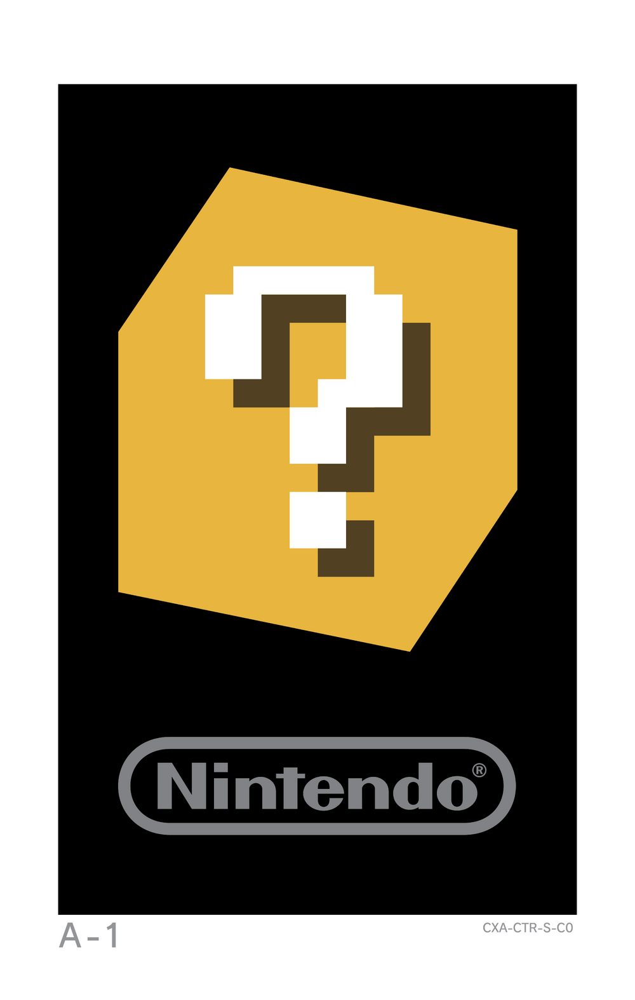

Paint me UP! is an AR painting game. Each level the player has 120 seconds to pick a color and paint the corresponding section of an object.

By painting all the parts in time, the player gets to learn what the parts add up to.

To play this game, you will need to print out an A4 sheet, with the AR marker.
Thhe image is this one.

